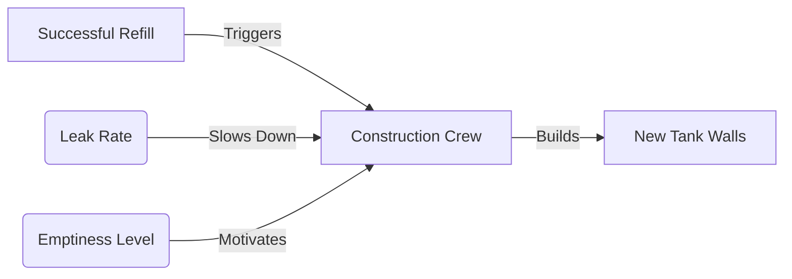
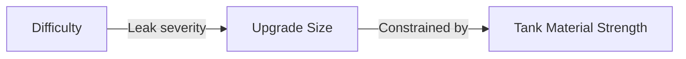

# Water Tank Analogy for Memory
Created on: 2025-07-12T16:06:36

⚡ Real-World Analogy
Imagine memory as a water tank:

- Stability (S) = Tank size (gallons)
- Retrievability (R) = Current water level (%)
- Difficulty (D) = Rate of leaks (high D = fast leaks)
- Reviews = Adding water:
    - Big pours when nearly empty (low R)
    - Small top-ups when nearly full (high R)

## In the real world water tank analogy - how would you explain Stability Growth?

### Stability Growth in the Water Tank Analogy  
**Imagine your memory is a water tank:**  

1. **Stability (S) = Tank Size**  
   - A bigger tank holds more water → Can go longer between refills  
   - *Example:*  
     - Small bucket (S=10) → Needs daily refilling  
     - Huge reservoir (S=100) → Lasts months  

2. **Stability Growth (ΔS) = Expanding the Tank**  
   - When you **successfully refill** the tank *before it empties*:  
     - You **add extra walls** to expand its capacity  
     - Expansion size depends on:  
       - ✅ **How empty it was** (low R → bigger expansion)  
       - ✅ **Leak rate** (low D → easier to expand)  

---

### 🌧️ How Tank Expansion Works  
| Scenario              | Tank Expansion (ΔS) | Real Memory Equivalent        |  
|-----------------------|----------------------|-------------------------------|  
| Refill at 30% empty   | +10% size            | Big S gain after hard recall  |  
| Refill at 5% empty    | +2% size             | Small S gain after easy recall|  
| Leaky tank (high D)   | +3% size (hard work) | Small gain for difficult cards|  
| Tight tank (low D)    | +20% size            | Large gain for easy cards     |  

---

### 🔧 The Expansion Process  
1. **Trigger**: Successful review = Refilling tank  
2. **Construction**:  
   - Workers (your brain) build new walls  
   - **Speed depends on leak rate (D)**:  
     - Low D (slow leaks) → Workers build fast  
     - High D (fast leaks) → Workers struggle  
3. **Result**:  
   - New size = Old size + ΔS  

---

### ⚠️ Critical Rule  
**No expansion if:**  
- Tank was overfilled (R>95%) → Workers don't bother ("too easy!")  
- Tank was empty (R=0%) → Workers must fix leaks first (relearning)  

---

### 🎯 Optimal Expansion Strategy  
**Best time to refill:** When tank is ~90% full  
- Workers maximize wall-building efficiency  
- Avoids:  
  - Wasted effort (refilling at 99%)  
  - Emergency repairs (running dry)  

---

### 💡 Anki Card to Cement This  
**Front:**  
In the water tank analogy, stability growth (ΔS) occurs when ______ and represents ______.  

**Back:**  
- **Occurs when**: You refill the tank *before it empties* (successful review)  
- **Represents**: Expanding the tank size (increasing memory durability)  

**Extra:**  

*"More empty = more motivation to build big!"*  

---

### Real-Life Example  
**Learning "Mitochondria = powerhouse":**  
- First review (S=1 day):  
  - Tiny bucket → Refill next day → +50% size (now S=1.5 days)  
- 5th review (S=30 days):  
  - Medium tank → Refill at 85% empty → +15% size (now S=34.5 days)  
- 20th review (S=2 years):  
  - Huge reservoir → Refill at 40% empty → +5% size  

This explains why early reviews rapidly increase intervals, while mature cards grow slowly!

For high-difficulty cards (leaky tanks):

Small capacity upgrades despite big pours

Upgrading requires structural reinforcements (mnemonics, chunking)

Analogy fix:

